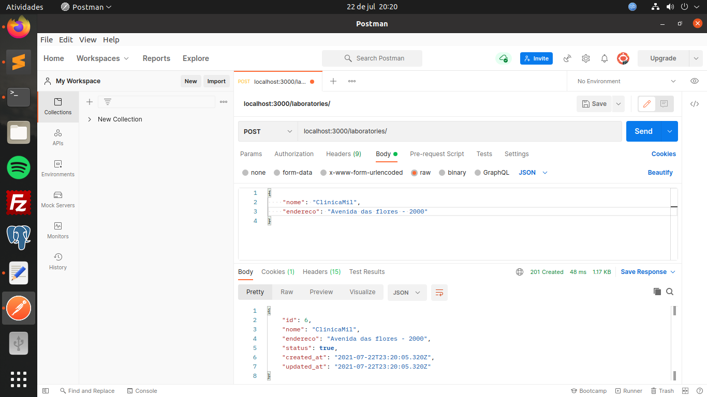
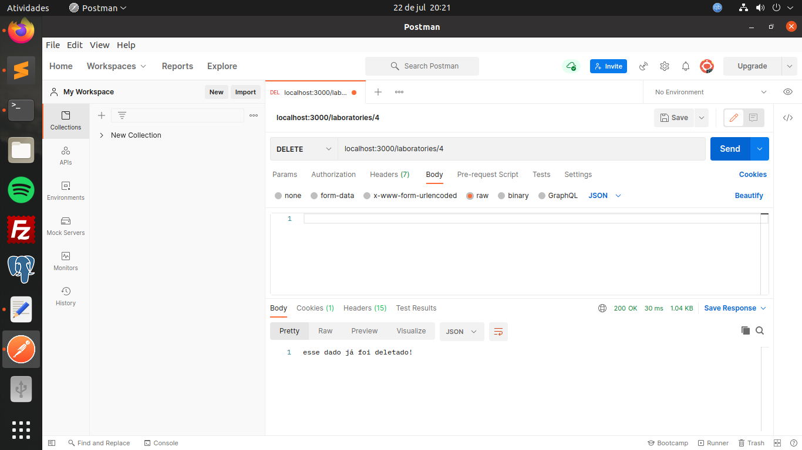
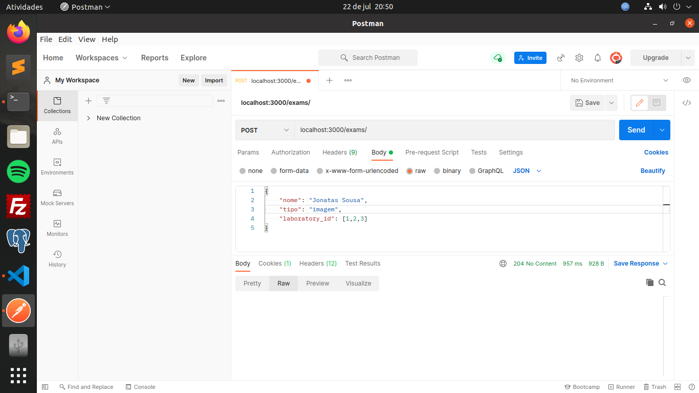
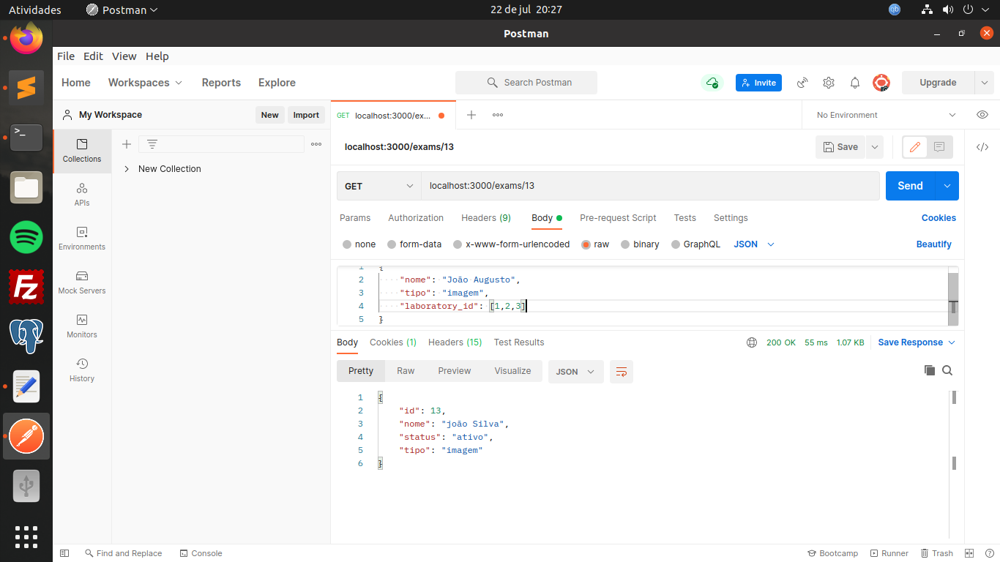

# Descrição da API
API desenvolvida para realizar manuntenção de laboratórios e exames

## _Configuração_
ruby on rails 6
sqlite

## _Arquitetura_

Para a construção dessa API eu utilizei o modelo de API que o rails disponibiliza para desenvolver cada funcionalidade do sistema. As requisições foram feitas através do postman utilizando o POST para criar algum exame ou laboratório, o GET para realizar as buscas direto do index da página, o PUT ou PATCH para realizar alguma atualização no dado e DELETE para deletar algum dado do banco.



<h3>Criando um novo laboratório. O status já vem como padrão ativo</h3>


<h3>Caso queira atualizar o laboratório, pode utilizar o método GET e passar o parametro que deseja atualizar</h3>



<h3>Para deletar um laboratório, pode utilizar o método DELETE e em seguida passar o id do dado que você deseja deletar</h3>


<h3>Poderá realizar a busca do laboratório através da própria index, utilizando o método GET</h3>



<h3>Poderá utilizar o método POST criar os exames e assim passar os laboratórios que aquele exame pertence em forma de arrays os laboratórios desejados</h3>


<h3>Para filtrar o exame, basta passar o nome do exame e ele retornará todos os laboratórios que aquele exame pertence através do método GET</h3>



<h3>Caso queira verificar os dados do exame, poderá passar o id do exame na url</h3>


## _pré-requisitos_

Antes de começar, é necessário ter instalado em sua máquina as seguintes ferramentas:
[GIT](https://git-scm.com), [YARN](https://classic.yarnpkg.com/en/docs/install/#windows-stable), [RAILS](https://gorails.com/setup/ubuntu/21.04), em relação a instalação do rails, é recomendável ele ser instalado no linux, caso esteja utilizando o windows, você poderá utilizar o WSL para instalar e executar o rails. Além disso, iremos precisar de um ótimo editor de código [VSCODE](https://code.visualstudio.com/download)

### 🎲 _Rodando o projeto_

```bash
# Faça o clone desse repositório
https://github.com/jonatasvenancio167/laboratorio.git

# Acesse a pasta do projeto
cd laboratorio

# Primeiramente rode a migration
rails db:migrate

# Agora execute o projeto em sua máquina local pelo terminal
rails s
obs: O projeto vai está rodando na porta 3000: localhost:3000

# É necessário ter algum software que faça as requisições direto para a api
Exemplo de software: postman
```